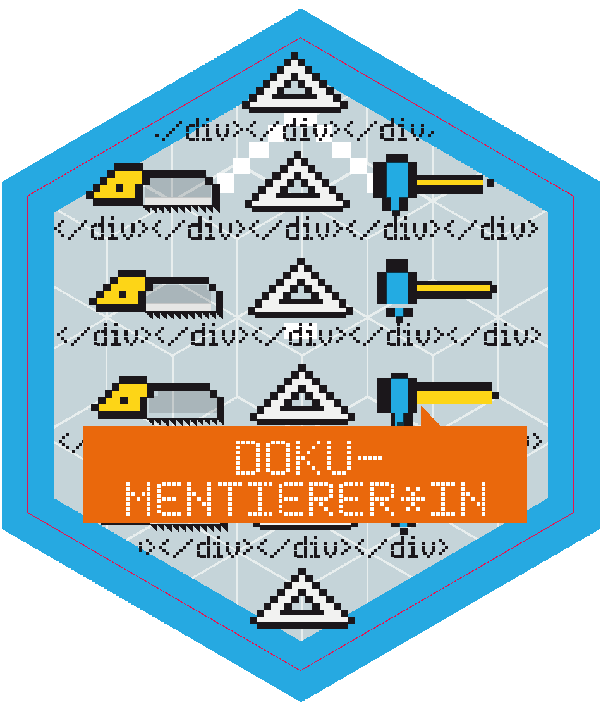
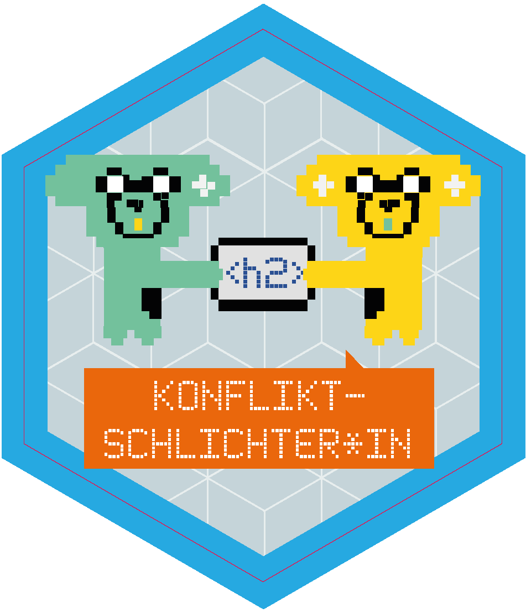
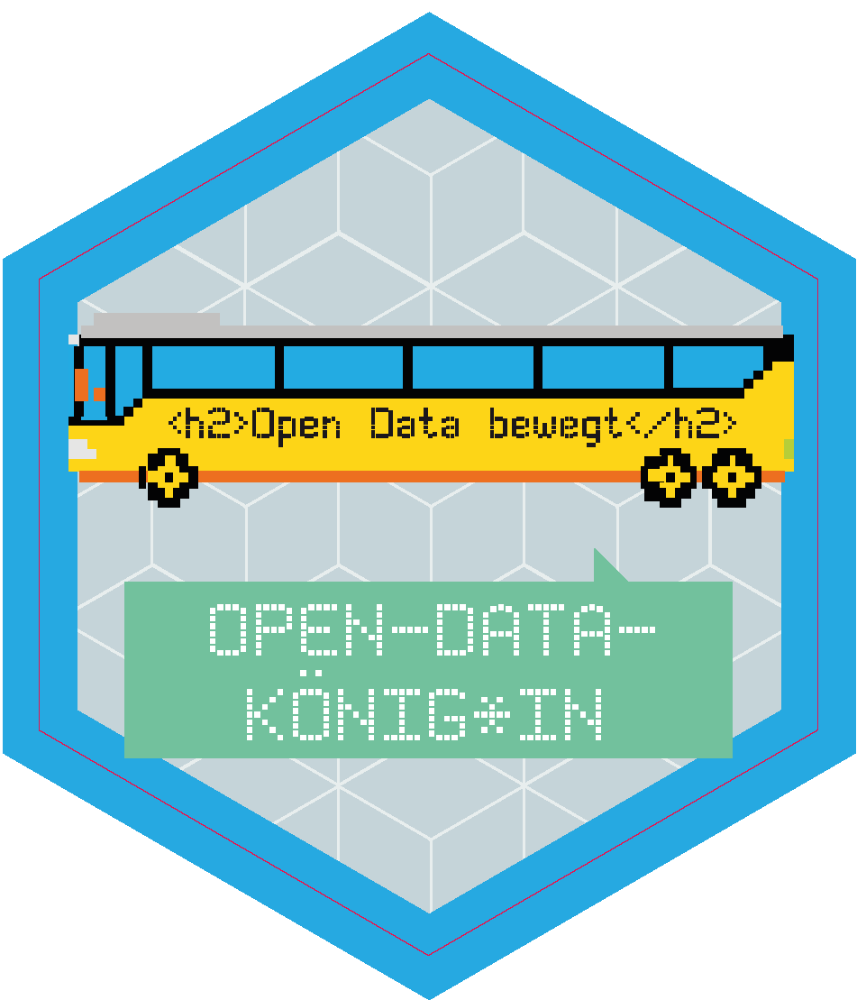
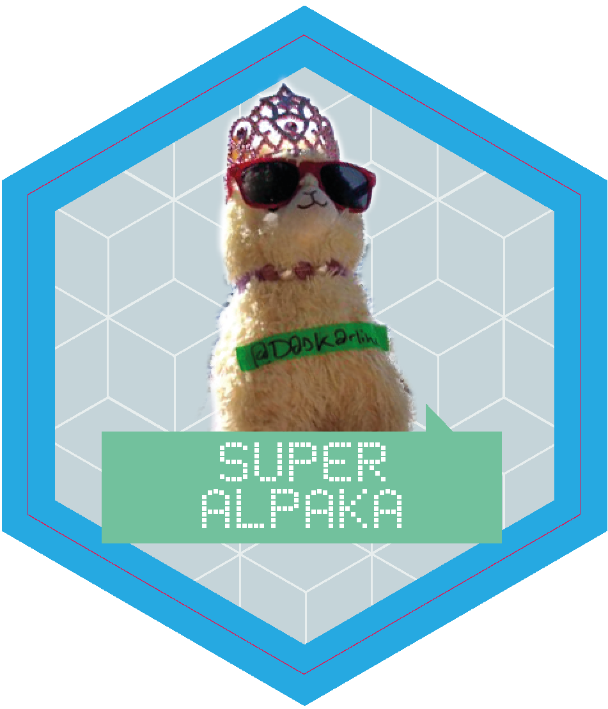
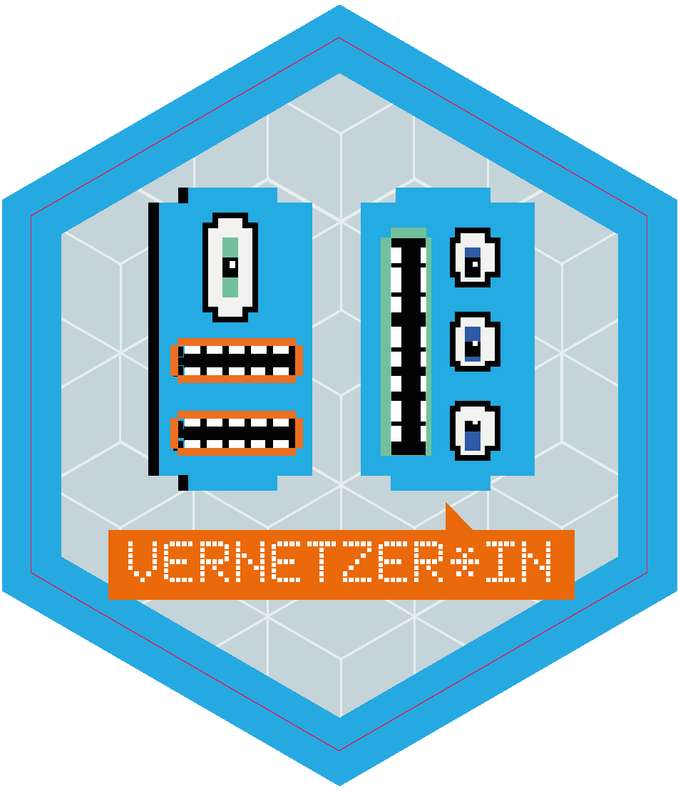
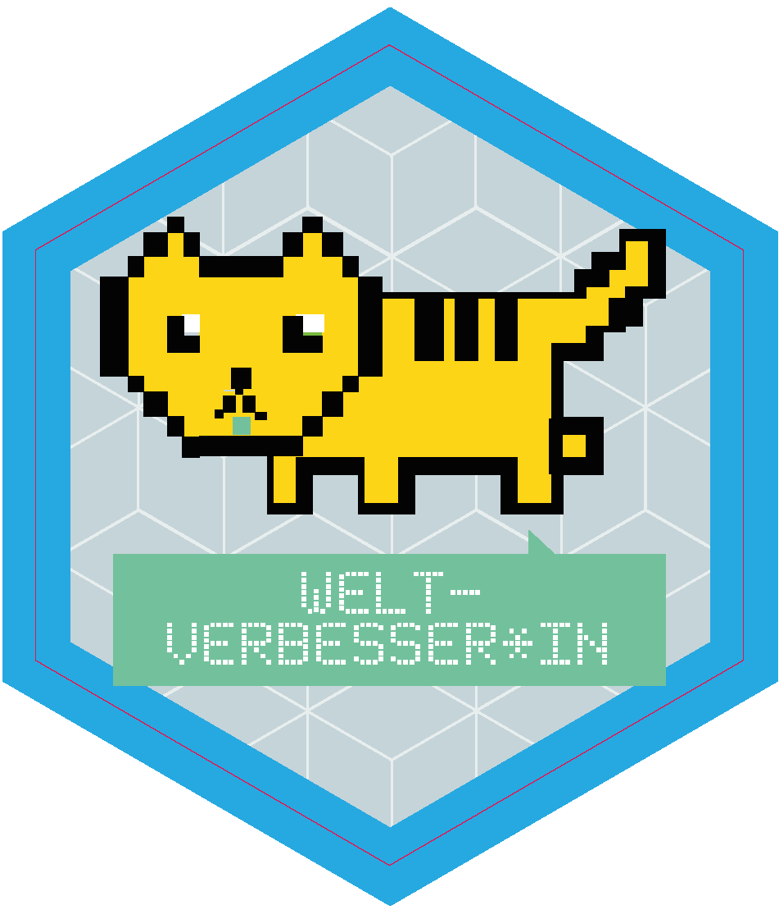
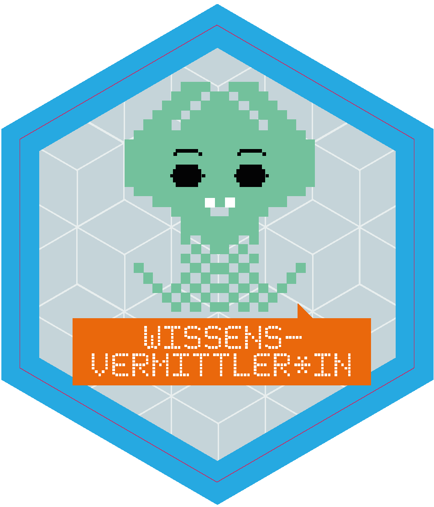

# Badges
## Designer\*in

## Dokumentierer\*in

## Helfende Hände

## Konfliktschlichter\*in

## Open-Data-König\*in

## Open-Source-Held\*in

## Super Alpaka

## Vernetzer\*in

## Welt-Verbesser\*in

## Wissensvermittler\*in

